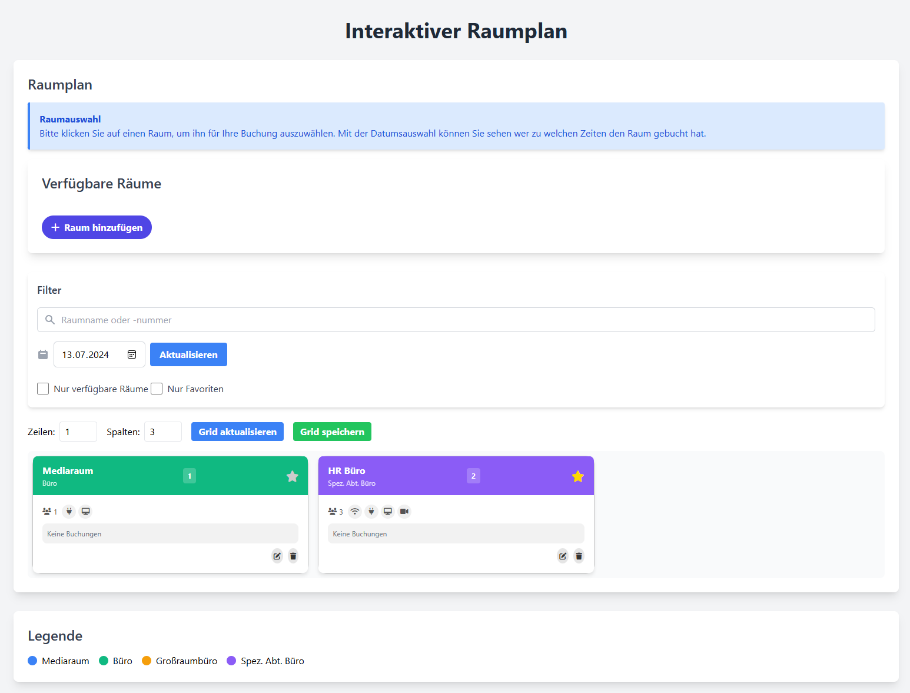
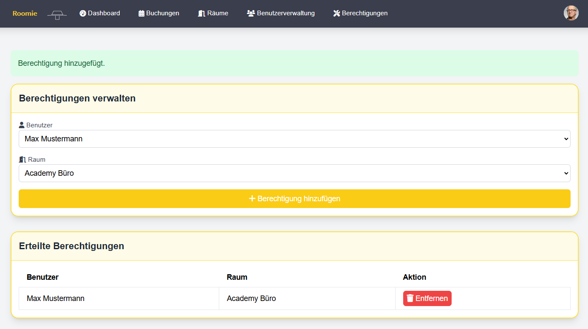

# Roomie 

Roomie  ist eine Webanwendung zur Verwaltung und Buchung von Räumen in einem Bürogebäude.

## Funktionen

- **📊 Dashboard**: Erhalten Sie eine sofortige Übersicht über alle verfügbaren Räume und deren aktuelle Belegung. Verpassen Sie nie wieder einen freien Raum!
- **🗺️ Interaktiver Raumplan mit Raumverwaltung**: Nutzen Sie unser visuell ansprechendes Grid, um Räume auf einen Blick zu sehen. Admins können mühelos neue Räume hinzufügen und bestehende verwalten.
- **📅 Buchungen**: Planen und verwalten Sie Ihre Raumreservierungen mit Leichtigkeit. Erhalten Sie ICS-Dateien und automatische E-Mail-Benachrichtigungen, um stets auf dem Laufenden zu bleiben.
- **🏢 Räume**: Behalten Sie die Kontrolle über alle verfügbaren Räume und deren Nutzung. Verwalten Sie Kapazitäten, Ausstattung und Verfügbarkeit effizient.
- **👥 Benutzerverwaltung**: Verwalten Sie Ihre Benutzer schnell und unkompliziert. Legen Sie neue Benutzer an, aktualisieren Sie Informationen und vergeben Sie Berechtigungen im Handumdrehen.

## Technologien

- **Frontend**: HTML, CSS, JavaScript, Alpine.js, Tailwind CSS
- **Backend**: PHP, SQLite

## Screenshots
### Startseite

### Buchungen

### Interaktiver Raumplan

### Raumübersicht

### Berchtigungsmatrix wer darf Räume buchen

### Raum Administration
