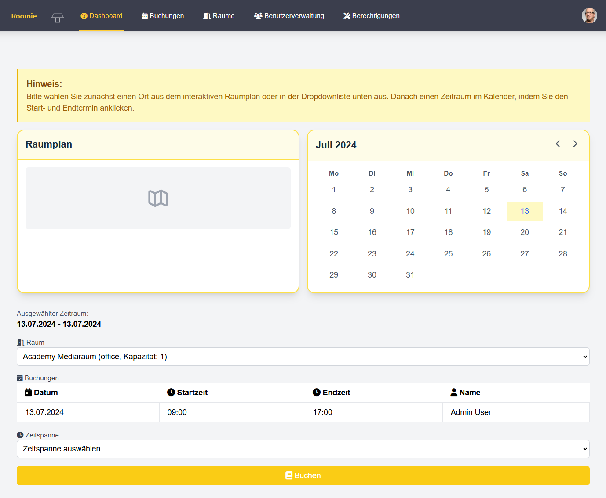

# Roomie 

Roomie  ist eine Webanwendung zur Verwaltung und Buchung von Räumen in einem Bürogebäude.

## Funktionen

- **Dashboard**: Übersicht über verfügbare Räume und deren Belegung.
- **Buchungen**: Anzeigen und Verwalten von Raumreservierungen.
- **Räume**: Verwaltung der verfügbaren Räume.

## Technologien

- **Frontend**: HTML, CSS, JavaScript, Alpine.js, Tailwind CSS
- **Backend**: PHP, SQLite

## Screenshots
### Startseite

### Buchungen

### Raumübersicht

### Raum Administration
